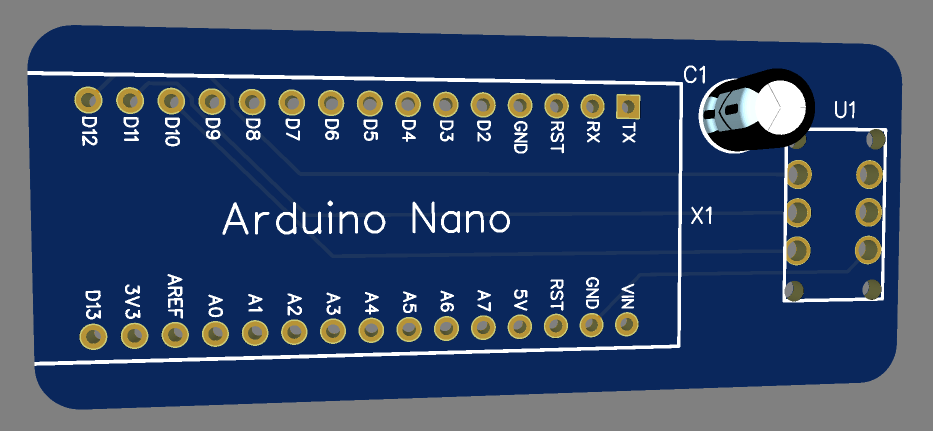

# ATTiny Programmer Shield for Arduino Nano

## Overview

Welcome to the ATTiny Programmer Shield project! This shield is designed to make programming ATTiny microcontrollers easier and more accessible using an Arduino Nano as the programming interface. It includes support for an OIC8 SOP8 to DIP8 EZ Socket Converter or an 8-pin socket, allowing for flexibility in your programming needs.

## Features

- **Arduino Nano Integration**: Use your Arduino Nano as the programmer for ATTiny microcontrollers.
- **Versatile Microcontroller Socket**: Compatible with OIC8 SOP8 to DIP8 EZ Socket Converters or standard 8-pin sockets.
- **Capacitor Slot**: Ensures stable and reliable programming by regulating the power supply.

## Components

- Arduino Nano
- OIC8 SOP8 to DIP8 EZ Socket Converter or 8-pin socket
- Capacitors for power stability

## Assembly Instructions

1. **Insert Arduino Nano**: Place your Arduino Nano into the designated slot on the PCB.
2. **Set up the Microcontroller Socket**: Attach either the OIC8 SOP8 to DIP8 EZ Socket Converter or an 8-pin socket depending on your microcontroller.
3. **Connect Capacitors**: Insert capacitors in the provided slots to ensure stability during programming.

## Programming Guide

- **Connect the Arduino Nano to your computer via a USB cable.**
- **Ensure the Arduino IDE is installed and properly configured for the Arduino Nano and ATTiny microcontrollers.**
- **Load the appropriate bootloader or program onto the Arduino Nano to turn it into an ISP programmer.**
- **Follow specific instructions for programming the ATTiny family of microcontrollers using the Arduino as ISP.**

## Get Creative

Once your ATTiny microcontroller is programmed, it’s ready to be deployed in any project—from DIY gadgets and educational kits to smart home devices. This programmer shield is designed to simplify your workflow and inspire new ideas.

## Credits

This project was developed at The Hackers Workshop, dedicated to fostering innovation and supporting the DIY electronics community.

## Support

If you encounter any issues or have questions about assembling or using the programmer shield, please contact us at webmaster@thehackersworkshop.com.

## Contribute

Contributions to the project are welcome! Please visit our [GitHub repository](Link_to_GitHub_Repository) to download the schematics, provide feedback, or submit improvements.

Thank you for supporting The Hackers Workshop!
